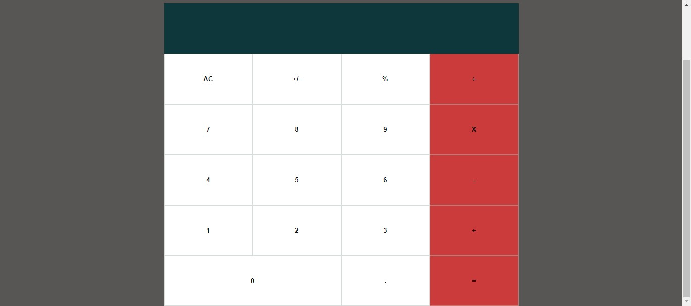

# Math-Magician

This project is a demo website for Math Magician, developed using React. Here I have practiced the basics of React, like,

- Props and States,
- component,
- Life-cycle methods,
- Hooks,
- Routers,
- Styling the React app,
- Testing React components.

## `Build-With:`

- React
- VScode

## `Live Demo:`

[math_magician](https://adoring-mcclintock-7acf81.netlify.app/)

## `Screen-shots:`

# Getting Started:

### `Prerequisites`

To get this project up and running locally, "npm install" is needed to be run in order to include all dependencies used for this project.

**To get this project set up on your local machine, follow these simple steps:**

1. Open Terminal.
2. Navigate to your desired location to download the contents of this repository.
3. Copy and paste the following code into the Terminal: git clone `https://github.com/AkintoyeOlamide/maths-magician`.
4. Into the Terminal: run `cd maths-magician`.
5. Into the Terminal: run `npm install`.
6. Into the Terminal: run `npm start`.
7. To see the website in the browser, open browser and load `localhost:3000`.

**To run the test suits:**

1. Into the Terminal: run `npm test`.
2. Press `a` to run all tests.

## `Author Details::`

👤 **Akintoye Olamide**

- Github: [@AkintoyeOlamide](https://github.com/AkintoyeOlamide)
- Linkedin: [@AkintoyeOlamide](https://www.linkedin.com/in/akintoyeolamide/)
- E-mail: <a href="mailto:akintoyeeolamide500@gmail.com?subject=Hello Olamide!">Email</a>

## `Show your support:`

Give ⭐ Star me on GitHub — it helps!

## 📝 `License`

This project is [MIT](lic.url) licensed.
